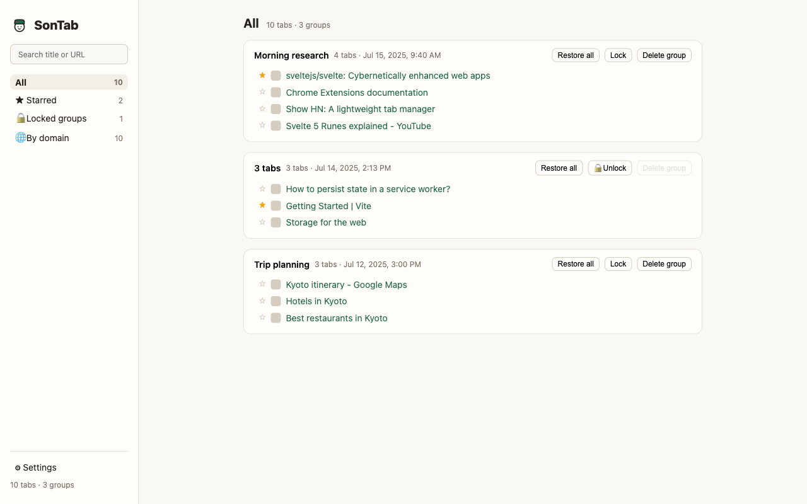

# SonTab

**English** | [한국어](README.ko.md)

A lightweight, OneTab-style tab manager for Chrome.
Click the toolbar icon to save every tab in the current window into a group and close them — freeing memory while keeping everything one click away.



## Features

- **One-click collect** — saves all unpinned tabs of the current window as a group, then closes them. Tabs are closed only after the data is safely stored.
- **Catalog view** — groups sorted by creation time (newest first), inline group renaming, group locking, restore/delete per tab or per group.
- **By-domain view** — see every saved tab grouped by site (`www.` ignored), with the source group shown next to each tab. Shows the newest N tabs per domain (1/5/10/20, configurable) with expand/collapse.
- **Search & filters** — live search over titles and URLs, plus Starred and Locked-groups views.
- **Starred tabs** — star pages you want to revisit; they stay in the list even after being restored.
- **Home-page decluttering** — root pages like `google.com` or `x.com` are hidden automatically (starred tabs exempt; can be turned off).
- **Import / Export** — OneTab-compatible text format, plus importing a saved OneTab HTML page with group names and original creation dates preserved.
- **Themes** — auto (follows your device), light, or dark. Paper-archive design.
- **5 languages** — English, Español, Français, 한국어, 日本語. Your browser language is detected on first launch.
- **Private by design** — no backend, no analytics. Everything stays in `chrome.storage.local`. Zero runtime dependencies.

## Install (from source)

1. `npm install && npm run build`
2. Open `chrome://extensions` and enable **Developer mode**
3. Click **Load unpacked** and select the `dist/` folder

## Development

```bash
npm install
npm run build     # build to dist/
npm run dev       # watch build
npm run test      # Vitest unit tests
npm run check     # svelte-check type checking
```

Built with Svelte 5 + TypeScript + Vite (Manifest V3, no runtime dependencies).

## Structure

- `src/background.ts` — service worker: collect / save / close tabs
- `src/storage.ts` — group CRUD and settings (pure logic + `chrome.storage` adapters)
- `src/domain.ts` — domain grouping and home-page hiding (pure logic)
- `src/importExport.ts` — OneTab-compatible text/HTML parsers
- `src/i18n.ts` — dependency-free i18n (EN/ES/FR/KO/JA)
- `src/theme.ts` — auto/light/dark theme resolution
- `src/list/` — Svelte 5 list page (catalog, by-domain view, settings)
